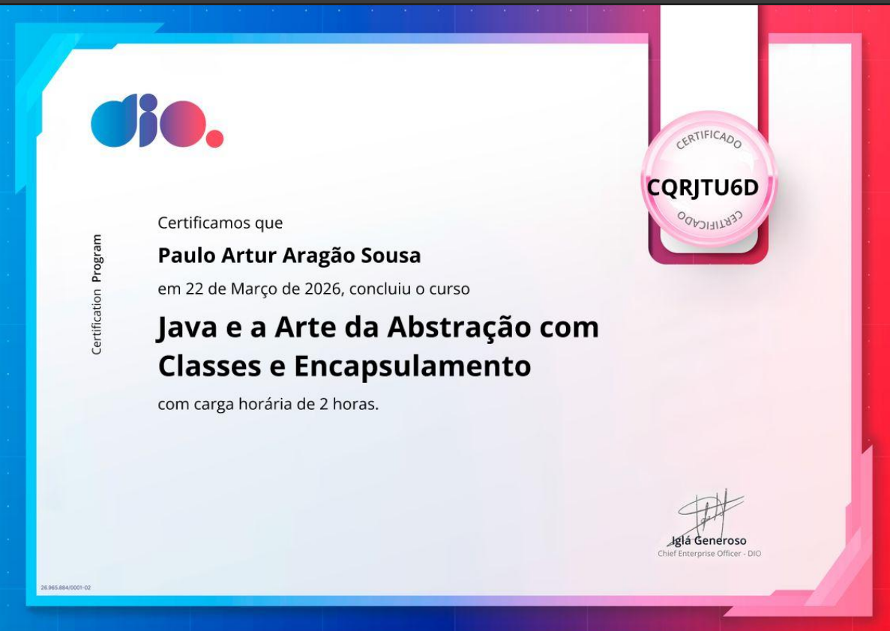

# 🐾 PETMACHINE - Sistema de Gerenciamento de Banhos

Este projeto foi desenvolvido para consolidar meus conhecimentos em **Programação Orientada a Objetos (POO)** e **Tratamento de Exceções** em Java. O sistema simula o controle de serviços de um pet shop, focando em segurança de dados e organização de código.

## 🚀 Tecnologias e Conceitos
* **Linguagem:** Java 17
* **Conceitos aplicados:** Abstração, Encapsulamento, Herança e Polimorfismo.
* **Segurança:** Tratamento de erros com blocos `try-catch` e exceções personalizadas.

---

## 🎓 Aplicação Prática de Certificação

Este repositório é a aplicação real dos conhecimentos teóricos obtidos na plataforma **DIO (Digital Innovation One)**.

### **Java e a Arte da Abstração com Classes e Encapsulamento**
* **Instituição:** DIO
* **Carga Horária:** 2 horas
* **Conclusão:** 22 de Março de 2026
* **ID de Verificação:** `CQRJTU6D`

<p align="center">
  
</p>

### 🛠️ O que implementei com base neste curso:
Como aluno de Ciência da Computação na **UFERSA**, foquei em aplicar os pilares do Back-End de forma profissional:
1.  **Abstração:** Definição de classes modelo para os Pets e Serviços, impedindo instâncias incompletas no sistema.
2.  **Encapsulamento:** Todos os atributos sensíveis estão como `private`, sendo acessados apenas por Getters e Setters validados.
3.  **Gestão de Erros:** Implementei uma lógica onde o sistema não "quebra" caso ocorra uma entrada inválida, informando o erro de forma amigável ao usuário.

---

## 🛠️ Como rodar o projeto
1. Clone o repositório:
   ```bash
   git clone [https://github.com/pauloartur-dev/PETMACHINE.git](https://github.com/pauloartur-dev/PETMACHINE.git)